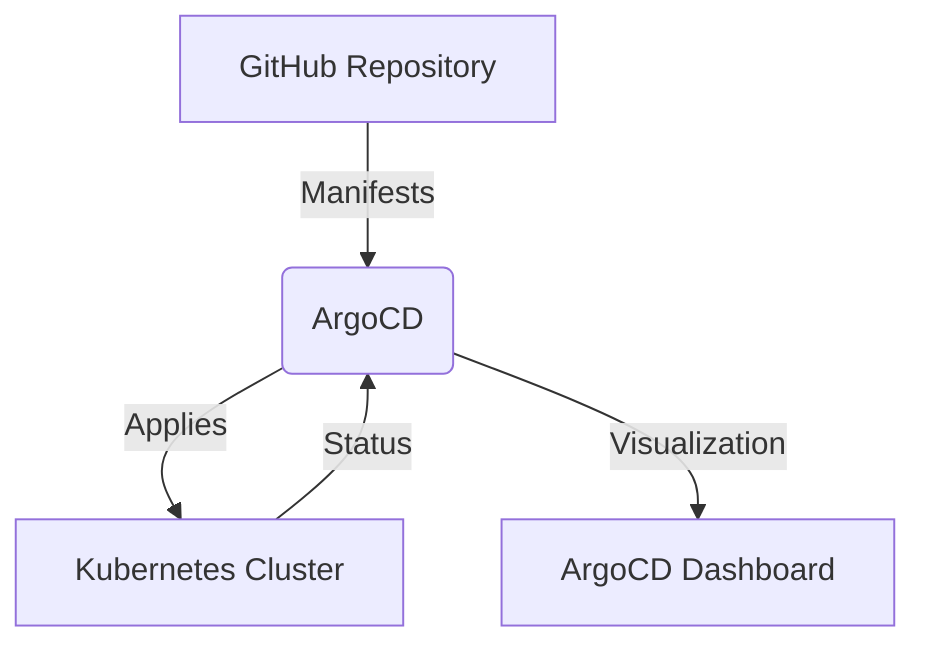

# GitOps with ArgoCD on Kubernetes (AWS EC2)

[](https://argoproj.github.io/argo-cd/)
[](https://k3s.io/)
[](LICENSE)

A complete implementation of GitOps workflow using ArgoCD on Kubernetes (k3s) running on AWS EC2 Ubuntu instance.

## 📌 Table of Contents
- [Features](#-features)
- [Architecture](#-architecture)
- [Prerequisites](#-prerequisites)
- [Setup Guide](#-setup-guide)
- [Usage](#-usage)
- [Testing GitOps](#-testing-gitops)
- [Troubleshooting](#-troubleshooting)
- [Contributing](#-contributing)
- [License](#-license)

## ✨ Features
- **Git as Single Source of Truth** - All Kubernetes manifests stored in Git
- **Automated Synchronization** - ArgoCD auto-syncs changes from Git to cluster
- **Self-Healing** - Automatic drift correction
- **Declarative Infrastructure** - Everything defined as code
- **Easy Rollbacks** - Git history enables version control

## 🏗 Architecture

## 🛠 Prerequisites
- AWS account with EC2 access
- Ubuntu 22.04 EC2 instance (t2.medium recommended)
-GitHub account
-Basic knowledge of Kubernetes and Git

## 🚀 Setup Guide
- 1. Launch EC2 Instance
- Ubuntu 22.04 LTS
- t2.medium instance type
- Security groups allowing:
- SSH (22)
- HTTP (80)
- HTTPS (443)
- NodePort (30000-32767)

- 2. Install Dependencies
````
ssh -i "your-key.pem" ubuntu@<EC2_PUBLIC_IP>
sudo apt update && sudo apt upgrade -y
sudo apt install -y docker.io git curl
````
- 3. Install k3s (Lightweight Kubernetes)
```
curl -sfL https://get.k3s.io | sh -
sudo kubectl get nodes  # Verify installation
```
- 4. Deploy ArgoCD
```
sudo kubectl create namespace argocd
sudo kubectl apply -n argocd -f https://raw.githubusercontent.com/argoproj/argo-cd/stable/manifests/install.yaml
```
- 5. Access ArgoCD UI
# Expose ArgoCD
```
sudo kubectl patch svc argocd-server -n argocd -p '{"spec": {"type": "LoadBalancer"}}'
```
# Get credentials
```
echo "Username: admin"
sudo kubectl -n argocd get secret argocd-initial-admin-secret -o jsonpath="{.data.password}" | base64 -d
```
Access dashboard at: http://<EC2_PUBLIC_IP>

### 🖥 Usage
- Clone this repository

````
git clone https://github.com/your-username/gitops-apps.git
cd gitops-apps
````
Configure ArgoCD Application

In ArgoCD UI, create new application:

Application Name: nginx-app

Project: default

Sync Policy: Automatic

Repository URL: Your Git repo URL

Path: nginx-deployment/

Cluster: https://kubernetes.default.svc

Namespace: default

Verify Deployment

```
sudo kubectl get pods
sudo kubectl get svc nginx-service
Access Nginx at: http://<NGINX_SERVICE_IP>
```

### 🔄 Testing GitOps
- Make changes to manifests in Git
# Example: Update nginx version
````
vim nginx-deployment/deployment.yaml
````
- Commit and push changes

```
git add .
git commit -m "Update nginx version"
git push origin main
```
- Watch ArgoCD automatically sync changes!

### 🐛 Troubleshooting
- Issue: ArgoCD pods not starting

```
sudo kubectl get pods -n argocd
sudo kubectl describe pod <pod-name> -n argocd
sudo kubectl logs <pod-name> -n argocd
```
- Issue: Cannot access ArgoCD UI

```
sudo kubectl get svc -n argocd
```
# Check if EXTERNAL-IP is assigned
🤝 Contributing
Contributions are welcome! Please open an issue or submit a PR.

Fork the repository

Create your feature branch (git checkout -b feature/fooBar)

Commit your changes (git commit -am 'Add some fooBar')

Push to the branch (git push origin feature/fooBar)

Create a new Pull Request

📜 License
Distributed under the MIT License. See LICENSE for more information.

Made with ❤️ by H Sareen Kumar 
